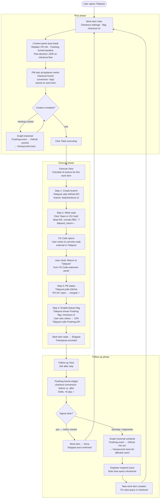

# Tidepool v0 — Plan → Execute → Follow-up Flow

## Scenario

An engineer and PM align on shipping a checkout-page redesign behind a feature flag. The engineer writes the code (launching VS Code via deep-link), opens a PR, merges it, and enables a PostHog flag at 10% rollout. Twenty-four hours later, both check Tidepool: the checkout funnel conversion metric moved. The loop closes.

## Flow diagram

## States and transitions summary

| State | Phase | Entry | Exit |
|---|---|---|---|
| Work Item View | Plan | Open work item | Context complete → Start executing |
| Context Panel | Plan | Auto-load on open; manual traversal | Dismissed or fully resolved |
| Graph Traversal | Plan/Follow-up | Missing context or anomaly detected | Finding pinned to work item |
| Execute View | Execute | Start executing | All checklist steps complete |
| VS Code (external) | Execute | Deep-link from Tidepool | Return deep-link → back to Tidepool |
| Follow-up View | Follow-up | 24h after Shipped; or manually triggered | Metric confirmed → Done, or Anomaly → new work item |

## Integration touchpoints

| Tool | Phase | Action |
|---|---|---|
| GitHub | Execute | Create branch; poll PR status; detect merge |
| PostHog | Execute | Enable/configure feature flag; set rollout % |
| PostHog | Follow-up | Pull funnel metric; before/after delta |
| Honeycomb | Follow-up (anomaly path) | Pull trace for affected cohort |
