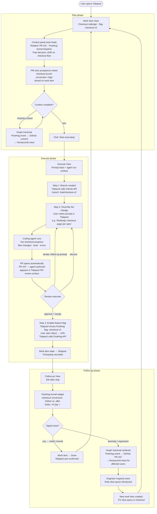

# Tidepool v0 — Plan → Execute → Follow-up Flow

## Scenario

An engineer and PM align on shipping a checkout-page redesign behind a feature flag. The engineer describes the change as a prompt; a coding agent makes the change and opens a PR automatically. The engineer reviews and merges the PR inside Tidepool, then enables a PostHog flag at 10% rollout — all without leaving Tidepool. Twenty-four hours later, both check Tidepool: the checkout funnel conversion metric moved. The loop closes.

*(VS Code deep-linking was proposed in the original design and rejected at G2. See ADR-0006: execute is prompt-driven; no IDE integration of any kind.)*

## Flow diagram

## States and transitions summary

| State | Phase | Entry | Exit |
|---|---|---|---|
| Work Item View | Plan | Open work item | Context complete → Start executing |
| Context Panel | Plan | Auto-load on open; manual traversal | Dismissed or fully resolved |
| Graph Traversal | Plan/Follow-up | Missing context or anomaly detected | Finding pinned to work item |
| Execute View | Execute | Start executing | PR merged + flag enabled → Shipped |
| Follow-up View | Follow-up | 24h after Shipped; or manually triggered | Metric confirmed → Done, or Anomaly → new work item |

## Integration touchpoints

| Tool | Phase | Action |
|---|---|---|
| GitHub | Execute | Create branch; coding agent opens PR; user merges via Tidepool |
| Coding agent | Execute | Receives prompt; writes code; opens PR; accepts follow-up prompts |
| PostHog | Execute | Enable/configure feature flag; set rollout % |
| PostHog | Follow-up | Pull funnel metric; before/after delta |
| Honeycomb | Follow-up (anomaly path) | Pull trace for affected cohort |
